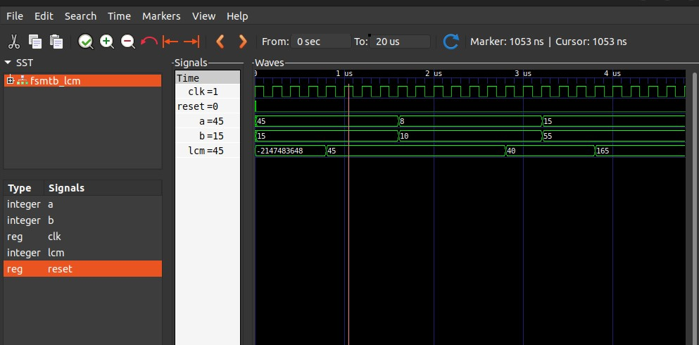

<!DOCTYPE html>
<html lang="en">
  <head>
    <meta charset="UTF-8" />
    <meta name="viewport" content="width=device-width, initial-scale=1.0" />
    <title>LCM</title>
  </head>
  <body>
    <h1>LCM solution using VHDL.</h1>
    <h2>2074 BHADRA</h2>
    
  </body>
</html>
